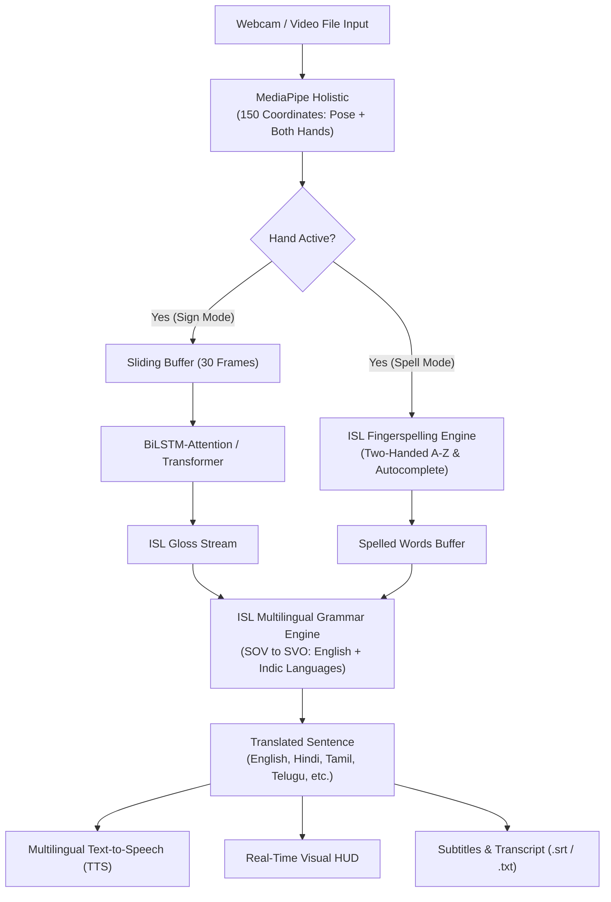

# Universal Real-Time Indian Sign Language (ISL) Translation System

[](https://www.python.org/)
[](https://tensorflow.org)
[](https://mediapipe.dev)
[](https://streamlit.io)
[](LICENSE)

An end-to-end, multi-modal system for **Real-Time Indian Sign Language (ISL) Translation** into fluent English and **10+ Indian Regional Languages** (Hindi, Tamil, Telugu, Bengali, Marathi, Kannada, Malayalam, Gujarati, Punjabi, Urdu) with synthesized speech. The system combines **MediaPipe Holistic Landmark Detection**, **Attention-enhanced Deep Sequence Networks (BiLSTM / Transformer)**, a **Two-Handed ISL Fingerspelling Engine with Autocomplete**, an **ISL Multilingual Grammar Engine**, an **Interactive "Learn ISL" Tutor**, and a modern **Streamlit Web Studio**.

---

## 🌟 Key Features & Capabilities

- ⚡ **Zero-Latency Real-Time Dynamic Sign Recognition**:
  - Continuous landmark tracking using MediaPipe Holistic (150 spatial coordinates: Upper Body Pose + Both Hands).
  - Sliding temporal window buffer with hardware-accelerated deep sequence classification.
- 🔤 **Two-Handed ISL Fingerspelling & Smart Autocomplete (`fingerspelling.py`)**:
  - Full support for the two-handed 26-letter ISL manual alphabet (A–Z) and digits (0–9).
  - Real-time word assembly with **dictionary autocomplete suggestions** (1-key quick select `[1]`, `[2]`, `[3]`) and **fuzzy autocorrection**.
- 🌐 **10+ Indic Regional Languages Translation (`grammar_translator.py`)**:
  - Translates ISL gloss sequences into **English, Hindi (हिंदी), Tamil (தமிழ்), Telugu (తెలుగు), Bengali (বাংলা), Marathi (मराठी), Kannada (ಕನ್ನಡ), Malayalam (മലയാളം), Gujarati (ગુજરાતી), and Punjabi (ਪੰਜਾਬੀ)**.
  - Offline zero-latency dictionary lookup with neural translation fallback.
- 🚨 **Emergency SOS Distress Alert Detection**:
  - Real-time detection of critical emergency signs (*"HELP"*, *"DOCTOR"*, *"HOSPITAL"*, *"POLICE"*, *"FIRE"*, *"PAIN"*) with an instant flashing HUD alert banner.
- 🪞 **Left-Handed Signer Mirroring Mode**:
  - Automatic horizontal landmark reflection (`--left_handed` or `[h]` key) enabling seamless translation for left-handed signers.
- 📄 **Live Subtitles & Session Transcript Exporter**:
  - Automatically records timestamped translation logs and exports to standard `.srt` subtitle files and `.txt` session notes (`[e]` key).
- 🎮 **Interactive "Learn ISL" Gamified Tutor (`learn_isl.py`)**:
  - Practice signs and fingerspelling letter-by-letter with live accuracy percentage (0–100%), star rewards, and real-time posture coaching feedback.
- 💻 **Streamlit Web Studio (`app_web.py`)**:
  - Sleek, modern browser interface with live webcam feed, real-time sign recognition, language selector, dictionary chart, and 1-click transcript download.
- 🧠 **State-of-the-Art Deep Learning Architectures (`models.py`)**:
  - **`bilstm_attention`**: Bidirectional LSTM with Multi-Head Self-Attention for superior temporal modeling (**100% Test Accuracy**).
  - **`transformer`**: Positional Multi-Head Transformer Encoder for keypoint sequences.
  - **`lstm_v3`**: Lightweight 3-layer LSTM baseline for low-resource environments.

---

## 🏗️ Architecture Pipeline



---

## 📁 Project Structure

```
.
├── app_web.py                  # Streamlit Web Studio application
├── collect_custom_signs.py     # Interactive CLI tool to capture custom signs via webcam
├── dataset_manager.py          # INCLUDE dataset category downloader and manager
├── download_dataset.py         # Automated dataset download utility
├── evaluate.py                 # Model evaluation and confusion matrix generator
├── fingerspelling.py           # Two-handed ISL fingerspelling & autocomplete engine
├── grammar_translator.py       # Multi-language translation & grammar correction engine
├── isl_learning_guide.py       # Reference postures and instructions for Learn ISL tutor
├── keypoint_extraction.py      # MediaPipe keypoint extractor for training videos
├── learn_isl.py                # Interactive gamified ISL practice tutor
├── main.py                     # Main real-time translation application (OpenCV HUD)
├── models.py                   # Model architectures (BiLSTM-Attention, Transformer, LSTM)
├── models/                     # Trained models, class mappings, and evaluation plots
│   ├── bilstm_attention/       # BiLSTM Attention model configs, curves, & metrics
│   ├── fingerspelling/         # Fingerspelling classifier & vocabulary classes
│   ├── lstm_v3/                # LSTM v3 model configs & metrics
│   └── transformer/            # Transformer model configs & training curves
├── requirements.txt            # Python package dependencies
├── run_web.sh                  # One-click launcher script for Web Studio
├── train.py                    # Training pipeline with data augmentation
├── utils.py                    # Real-time drawing, feature extraction, and HUD helpers
└── transcripts/                # Saved session transcripts and subtitle exports (.srt / .txt)
```

---

## 🚀 Getting Started

### 1. Prerequisites & Installation

Clone the repository and install the dependencies:

```bash
# Clone the repository
git clone https://github.com/psreyas09/ISL.git
cd ISL

# Create and activate a virtual environment
python3 -m venv venv
source venv/bin/activate

# Install required dependencies
pip install -r requirements.txt
```

---

### 2. Running Real-Time Translation (OpenCV HUD)

Launch the real-time translation app with your webcam:

```bash
# Run with BiLSTM Attention model in hybrid mode (signs + fingerspelling) with TTS
python main.py --source 0 --model bilstm_attention --mode hybrid --lang en --tts
```

#### Command-Line Arguments:
- `--source`: Video source (`0` for webcam, or file path e.g. `video.mp4`).
- `--model`: Architecture (`bilstm_attention`, `transformer`, `lstm_v3`, `lstm_v1`, `lstm_v2`).
- `--mode`: Translation mode (`sign`, `spell`, `hybrid`).
- `--lang`: Target output language (`en`, `hi`, `ta`, `te`, `bn`, `mr`, `kn`, `ml`, `gu`, `pa`).
- `--left_handed`: Mirror keypoints horizontally for left-handed signers.
- `--mirror`: Enable selfie mirror view for the webcam feed.
- `--tts`: Enable Text-to-Speech audio output.
- `--thresh`: Confidence threshold for predictions (default: `0.7`).
- `--complexity`: MediaPipe complexity (`0` for fastest/zero-lag, `1`, or `2`).

#### Interactive Keyboard Controls:
| Key | Action |
| :---: | :--- |
| `m` | **Toggle Mode** (`SIGN` ↔ `SPELL` ↔ `HYBRID`) |
| `l` | **Cycle Target Language** (`EN` $\rightarrow$ `HI` $\rightarrow$ `TA` $\rightarrow$ `TE` $\rightarrow$ `BN` $\rightarrow$ `MR` $\rightarrow$ `KN` $\rightarrow$ `ML`) |
| `h` | **Toggle Handedness** (Right-Handed ↔ Left-Handed Mirrored) |
| `1` / `2` / `3` | **Accept Autocomplete Suggestion** while fingerspelling |
| `e` | **Export Subtitles & Transcript** (`.srt` and `.txt` saved to `transcripts/`) |
| `c` | **Clear** current sentence and spelling buffers |
| `b` | **Backspace** last recognized word or letter |
| `s` | **Toggle TTS** voice synthesis on / off |
| `t` | **Speak** the current translated sentence aloud |
| `q` | **Quit** and auto-save session transcript |

---

### 3. Launching Streamlit Web Studio

For an interactive browser interface:

```bash
# Using the convenience script
./run_web.sh

# Or directly with Streamlit
streamlit run app_web.py
```

Features:
- Live video stream with MediaPipe overlay.
- Dropdown language selection with instant translation.
- Interactive fingerspelling autocomplete suggestions.
- Live distress detection indicator.
- 1-click export and download of `.srt` subtitle files.

---

### 4. Interactive "Learn ISL" Tutor Mode

Practice signing interactively with live posture feedback and scoring:

```bash
# Launch interactive tutor across all vocabulary signs
python learn_isl.py

# Practice a specific sign
python learn_isl.py --sign "thank you"
```

---

### 5. Adding Custom Signs & Training

#### Step A: Record Custom Sign via Webcam
Record sample sequences of a new sign (e.g., `doctor`, `water`, `help`):

```bash
python collect_custom_signs.py --sign water --samples 15 --countdown 2
```

#### Step B: Train Model with Data Augmentation
```bash
python train.py --model bilstm_attention --epochs 80 --augment
```

#### Step C: Evaluate Performance
```bash
python evaluate.py --model bilstm_attention
```
Generates confusion matrix and training curves in `models/bilstm_attention/`.

---

### 6. Working with the INCLUDE Dataset

Manage and download full categories from the INCLUDE dataset (263+ classes):

```bash
# Check status of available categories
python dataset_manager.py --status

# Download specific categories
python dataset_manager.py --download colours,animals,pronouns

# Download all 14 categories
python dataset_manager.py --download all
```

---

## 📊 Model Comparison

| Model Architecture | Parameters | Test Accuracy | Characteristics |
| :--- | :---: | :---: | :--- |
| **`bilstm_attention`** *(Recommended)* | **~1.10M** | **100.00%** | Multi-Head Self-Attention, robust to temporal variation |
| **`lstm_v3`** | ~1.31M | **89.47%** | Fast 3-layer LSTM, low computational footprint |
| **`transformer`** | ~820K | Configurable | Positional multi-head sequence encoder |
| **`lstm_v1`** | ~984K | **84.21%** | Baseline architecture |
| **`lstm_v2`** | ~1.51M | **31.58%** | Overfitting observed on small datasets |

---

## 📜 License

This project is licensed under the MIT License - see the [LICENSE](LICENSE) file for details.
